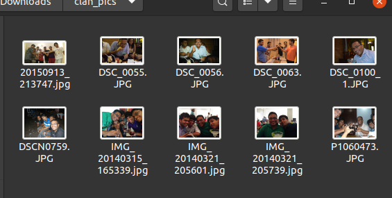

# Addate

Have you noticed that your various capture devices (your phone, camera, GoPro, etc) have their own file naming scheme?  
Usually this isn't a big deal; untill you try to move all you files in to one folder. This is when you realize that every piece of software (file manager, editors, image viewers, browsers, etc) defaults to alphabetically listing/consuming your files; making it difficult and sometimes impossible to view them in chronological order. Sometimes the gods are extra cruel and you can have conflicting filenames from multiple sources.

Addate (Add-Date) solves this annoyance by providing a multithreaded tool to prepend (append to front) the file creation date/time to your filenames. Using this lets your files be chronologically sorted by default!

| Before| After| 
|---------------|---------------|
||| 

Many thanks to [difference-engine/thumbnail-generator-ubuntu](https://github.com/difference-engine/thumbnail-generator-ubuntu) which I used as a reference. 

## Basic Usage
```
# Rename files in side a directory and it's subdirectories
addate -r -d directory1

# Rename files from two directories
addate -d directory1/directory1_1 directory2

# Pulling up the help
addate --help
```

## Command Line Options
| short | long          | Description                                                                                         |
|-------|---------------|-----------------------------------------------------------------------------------------------------|
| -d    | --img_dirs    | Directories to scan for files and rename; separated by space, eg: "dir1/dir2 dir3"  [required] |
| -w    | --workers     | No of processing threads to spawn                                                                    |
| -i    | --only_images | Whether to only rename images                                                   |
| -r    | --recursive   | Whether to recursively look in to sub folders for files                                                               |
|       | --help        | CLI help                                                                                            |

## Installation
Clone repo, navigate to folder and install using:
```
pip3 install .
```

To uninstall run:
```
pip3 uninstall addate
```
